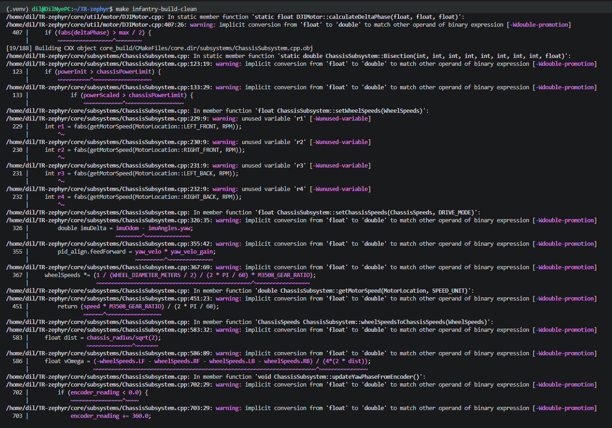

# Embed-Training-2026

Hello everyone!

This is the official repo for Trition Robotics Embedded training. The training is broken up into weeks, which each have their own read-me and assignment. The way the training is structured, our goal is for you to work on one part of embed at a time, so for example, in week 2 you're developing a driver for the BNO055 IMU, and then working on chassis and gimbal logic in the next. The ultimate goal is by the 5th week, your codebase should be a mini-embed repo, complete with yaw-oriented drive. If you're confused by the technical-speak, that's expected and okay, after all you have weeks to become fluent. 

Before you get started, something you should be aware of is that these trainings were written with some of our colloquial mannerisms. For instance, in week 3, when I mention doing something in "main", I'm really referring to infantry.cpp. Despite it being occassionally confusing, I have chosen to keep these in as "features" rather than bugs to be rewritten, since as a part of the training you should ideally be fluent with our vernacular, since that's the reality of any project team you'll be in. While I have done my best to try and explain these as they come up, by their nature it's likely that I've missed a few, so if you see any part of the trainings that are unclear, feel free to contact me.  

Good luck, and don't be afraid to contact your embed lead if you have any questions, I'm more than happy to yap. - Dil 
## Set Up

You will have to do some set up for this training, although it shouldn't take too terribly long. Unless if you're on windows, in which case, it could take some time. Luckily your author is on windows, so please contact me if/when you run into issues. 

Also, at the end of this page, I will have a list of helpful extensions you should have on VS Code. It is optional, but for your quality of life, you probably shouldn't skip it.

### 1. IDE

For those of you who already have a proper IDE set up with git, feel free to skip to the next part. For everyone else, your first step should be to download an IDE. While there are other options, such as CLion, the one we recommend is Visual Studio Code, which you can download [here](https://code.visualstudio.com/download?_exp_download=fb315fc982). If you're confused by all the options, just choose the big button at the top under each platform icon (if you're on linux I trust you can figure this out). From there, go ahead and set up VS code.

From there, the next step is to download git [here](https://git-scm.com/install/windows), and if you're mac/linux, make sure to select your proper OS at the top of the page. From there you'll have to go through a number of questions on your initial set up, but there should always be an option that's recommended. Unless if you know what you're doing, just go with that option. If you have questions during this step, feel free to contact your embed lead. 

Once you're done downloading and setting up git, head into VS code and sign into your git account. The following commands should come in handy for this 
```
git config --global user.name "Your Name"
git config --global user.email "your.email@example.com"
```

### 2. Fork and clone this repo

Once you have that all set up, go ahead and fork this repo, which you can do at the top of the page. 


After you've made your fork, make sure you share it with us, so that we can check your progress week to week. 

After you've done that, you should be able to clone your fork in VS code through the source control tab on the left, as shown below. 


### 3. Software and packages

Now, we need to download the necessary software and packages so that the code can properly compile. This section will be platform specific. Be aware that we primarily tested this process on windows machines, so you may run into issues on mac and linux. 

### Windows

Run the following commands. 

``` 
winget install Git.Git
winget install Kitware.CMake
winget install Ninja-build.Ninja
winget install --id Microsoft.VisualStudio.2022.BuildTools --override "--wait --passive --add Microsoft.VisualStudio.Workload.VCTools --includeRecommended"
```

Be aware that the last command is a fairly long download, so it'll take longer than the previous 3. Once you have that done, to make sure that it's all properly installed, go into your windows search bar, and search "Developer Powershell for VS Code 2022" (Note: at time of writing it was 2022, but it's highly likely that you're on 2026. The number should match whatever version of VS code you're actually on).


All you need is for it to show up, if it doesn't show up, that means that at the very least, the last command didn't work, and we suggest you try rerunning the install commands. If they're properly installed, they should all return that you already have the packages downloaded. 

Now that we have that set up, we'll have to configure some VS code settings. Start by opening up your preferences.json, which you can do by hitting ctrl+shift+P, and typing in "preferences: Open User Settings (JSON).


Once that's open, you'll want to append a comma to the last part of the settings, and then paste in the following:

```
"terminal.integrated.profiles.windows": {
  "Developer PowerShell for VS 2022": {
    "source": "PowerShell",
    "args": [
      "-NoExit", "-Command",
      "&{Import-Module 'C:\\Program Files (x86)\\Microsoft Visual Studio\\2022\\BuildTools\\Common7\\Tools\\Microsoft.VisualStudio.DevShell.dll'; Enter-VsDevShell -VsInstallPath 'C:\\Program Files (x86)\\Microsoft Visual Studio\\2022\\BuildTools' -SkipAutomaticLocation -DevCmdArguments '-arch=x64'}"
    ]
  }
},
"terminal.integrated.defaultProfile.windows": "Developer PowerShell for VS 2022"
```

What this does is make it so that we automatically boot into the Developer Powershell environment when we open VS code, and that we don't have to manually search for the Developer Powershell, cd into our repo, and then use `code .` to open up VS code. (Note: You can totally do that if you like, I just think its a hassle. I understand though if you know what you're doing and don't wanna mess with whatever you already have in your json.)

Also, note that my command assumes that VS code is downloaded in your C drive in your program files x86. If that isn't the case for you, you'll have to modify the command to include the proper path to your installation. (Contact your lead for help if you need it). 

When you're done, your json should look something like this 


Ok, now we're nearly done. Once you have saved your json file, you want to reboot VS code, and try the following command: 

```
cmake -S mini-repo -B mini-repo/build -G Ninja
```

If that results in something along the lines of 

```
- Configuring done (0.0s)
-- Generating done (0.0s)
-- Build files have been written to: D:/VS Code/TR/TR Training/Embed-Training-2026/mini-repo/build
cmake --build mini-repo/build --target infantry_check
ninja: no work to do.
```

Then you know you have it properly set up. 

Something you might have noticed is that the previous command is kind of painful to run every time we want to compile our code, so we can install 'make' to make our lives a little easier.

Run the following command, and restart 
```
winget install ezwinports.make
```

Then, try 'make infantry-build' in your terminal. You should see that you end up with the same output.

Ok windows people, you are free to get started with the trainings. 

### Mac

Ok Mac people, please be aware that your author does not use Mac, but from what Mr. Claude told me, your set up is actually very simple, here's what you need to do. Run the following commands.

```
xcode-select --install
/bin/bash -c "$(curl -fsSL https://raw.githubusercontent.com/Homebrew/install/HEAD/install.sh)"
brew install cmake ninja git 
```

I'm told that once homebrew is installed, it prints out a 'next steps' block, and that you should pay attention to it. 

To make sure that everything is working properly, try using `make infantry-build`, and see if it gets you something along the lines of 

```
- Configuring done (0.0s)
-- Generating done (0.0s)
-- Build files have been written to: D:/VS Code/TR/TR Training/Embed-Training-2026/mini-repo/build
cmake --build mini-repo/build --target infantry_check
ninja: no work to do.
```

If that doesn't work, try `cmake -S mini-repo -B mini-repo/build -G Ninja` 

### Linux

Hello Linux people, I'm also told that your set up process is really simple. Run the following:

```
sudo apt update
sudo apt install -y build-essential cmake ninja-build git
```

Then try `make infantry-build`. It should result in something similar to. 

```
- Configuring done (0.0s)
-- Generating done (0.0s)
-- Build files have been written to: D:/VS Code/TR/TR Training/Embed-Training-2026/mini-repo/build
cmake --build mini-repo/build --target infantry_check
ninja: no work to do.
```

If that doesn't work, try `cmake -S mini-repo -B mini-repo/build -G Ninja` 

## 4. Quality of Life Extensions

This part is assuming you're on VScode, but I imagine that if you're on some other IDE, you'll very likely have some analogs for these. These are arranged in order of most to least useful. Clangd is really the only one you need now, but the others are nice to have for when you start working on your capstone


### 1. Clangd

This extension basically makes your job as a programmer easier. It goes through the build and basically indexes everything (functions, variables, etc.) so that you can autocomplete things as you type, and more importantly, highlights all of your errors and questionably written code. Since it goes through the build it's a lot more robust than the C++ intellisense extension. 



Sometimes I fear it might be a little too thorough.

### 2. Serial Monitor

Should be pretty self-explanitory, this one lets you read print statements from the nucleo. 

### 3. Git Graph & GitLens

These two are both helpful for anything git-related. Inline gitblame w/ commit messages, as well as a visualized tree of all the different git branches and how they came to be. The second part won't be too relevant to you until you're farther along in your TR journey, but it doesn't hurt to mention them now. 

There's others along the way that are more niche, but if they're ever relevant to your projects hopefully I'll remember to let you know. 