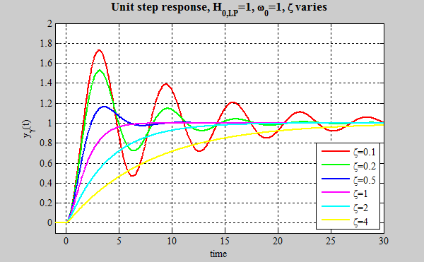

# Week 4 - Controls and PID Tuning

Hi guys welcome to controls hell - Arihant

You will have a goated mentor in Arjun this year for explaining controls concepts better than I ever could, but below is an attempt to explain it anyways :D enjoy (its simultaneously less srs than previous weeks and harder)

## What is Controls???

In control system theory a block diagram might look something like this:

Essentially the idea behind controls is that u have a certain input (signal/trajectory) and your plant will react to that input signal in a certain way. This is called the output signal or the behavior of the system. 

What a controller allows u to do is to follow the trajectory of the input signal as best as possible given the behavior of your plant. The combined controller and plant is called a system. Basically, you want your head to turn 90 degrees, and a controller will help the mtoro achieve this accurately and reliably. :D

## Why?

### Why do we care about controlling a system?

Take our yaw: if we just tell the motor to move 45 degrees to the right, does the motor know how much power it has to give and for how long to settle at that point? (Hint: no.)

This is an example of slow, unresponsive controls, we dont rly want this.

Physical systems have characteristics that make it harder for our mechanisms to achieve our goals reliably. For example, we may want to quickly drive from point A to point B, but friction and tire slip make us move slowly and unpredictably. When we want any physical system to respond the way we want, we need to make sure we have code written to convert our commands into something (usually a power/current) which the motor can understand and follow accurately/reliably. This is where controls comes in.

Now 🤓, we want to control a system to satisfy many objective metrics: 

- Quick turning to our desired position/velocity (aka low settling time)
- Low overshoot so we don’t get confused (if the robot oscillates around then its a little confusing for a driver)
- A fast rise time (our motor will look more responsive)

### How does it benefit us?

Well the most obvious benefit we can see is going to be good aim/CV, since good controls = fast aim = better accuracy from both human input and cv.

Secondly, a very important benefit that most people dont really think about for controls is the chassis motors. Good chassis controls exponentially improves our movement and helps significantly in ensuring accurate odometry.

So, the whole robot works smoother and feels more responsive when we have good controls (See: our robots looking snappy)

In general, good controls give our robots reliability and predictability that our team can lean on in competition. Particularly, in the context of competition, having reliable robots is key to success.

## How to tune a system

Now that you know why controls is important and gives us aura, how do we actually **do** controls on our robots? You can’t just vibe enter PID values and pray for the best (although we tried to do that during 2025 comp, did not work out well). 

The steps involved in controlling your motors well are:

- System Characterization: find out what your motor response looks like for certain inputs (we also need to choose good inputs for this)
- Block diagram: Here is where you represent what your controls loop will look like for turning your position/vel input into a current/power output. It’s also where we choose which method of controls we will use (PID, Lead Lag, Non-linear)
- System Tuning: We use our characterized system and our block diagram to find the equation inside our control block (PID etc) which will give us the performance we are looking for.
- Implementation in code: Then, we can take the equation and convert it to a representation in code, so that we can feed in our desired state and it'll spit out the necessary power.

BANGGGGGGG PROFIT AND AURA FARMAGE

## Okay, you get what controls are, but what's PID?

Our goat Anshal (may he rest in peace) made an older version of this training, where he goes into depth about PID. I will be using those notes to explain what PID is :)

PID is the controller we use for a lot of the systems on our robot. The main concept for a [PID controller](https://en.wikipedia.org/wiki/Proportional–integral–derivative_controller) is to take a desired value and an actual value, and minimize the difference between the two, which is referred to as "error". When the error is near zero then you have succesfully reached the setpoint. PID does this with three components, the Proportional component, the Integral component, and the Derivative component.

This is the underlying equation behind PID, and over the course of this week we will be teaching you what each component means

$u(t) = K_p\cdot e(t) + K_i\cdot\int^t_0{e(\tau)d\tau}~+ K_d\cdot \frac{d}{dt}\left[e\left(t\right)\right]$

*where e(t) is the error at time t, and u(t) is the output of the PID controller. In our case, when working with motors, <ins>u(t) will always be the power we give them</ins>*.

Effectively, we have a controller for a single action, so that aspect is tuned to use. We have individually tuned PIDs for the position and velocity of each motor, because each motor is in a unique position on the robot, with different load, friction, and other random qualities.

### Proportional

The first section of the PID Formula is proportional, P. The output here is simply directly proportional to the error.
An example scenario: We have a PID controller for a motor's position with values of {3.2, 0, 0}, so it only has P. We want the position to be at 40 ticks, but we are currently at 30 ticks. In this situation, our error is 10. The equation now looks as such.

$u(t) = K_p\cdot e(t)\to u(t) = 3.2(10) = 32$

The I and D components are simply ignored, because their weight coefficients are set to 0. In a situation when we are only using P, we get an output directly proportional to the error, 32.
The P component is for quick temporary bursts, and it will often be the first thing you attempt to tune.

### Integral

The second section of the PID Formula is integral, I. The output here is the integral of the error. Lets consider an example where the PID controller has values {0, 2.1, 0}. Here is a potential error vs time graph

Lets imagine we are now at 3.4 seconds, and the total integral of everything prior is -1.65. Our equation now looks like this.

$u(t) = K_i\cdot\int^t_0{e(\tau)d\tau} \to u(t) = 2.1(-1.65) = -3.465$

Now, due purely to integral, our output value is -3.465.
The integral is meant to be more persistent, as if the error is zero, integral will not shift, and the output from the integral component will be relatively stable. Often, we tune integral with both its coefficient and a max value, so that we don't have an integral that compounds into infinity.

_Note that since we are working with a *discrete* error function we need to use [numerical integration](https://en.wikipedia.org/wiki/Numerical_integration) methods_

### Derivative

The final aspect of PID is derivative. The output here is based upon the derivative of error. Lets consider an example where the PID controller has values {0, 0, 4.2} (Terrible values in practice).

Lets look at the same error vs time graph from before, except this time we are at 2.6 seconds.

Now, we are at 2.6 seconds, observe the green line. The slope of that green line is the derivative of the error at 2.6 seconds, which is 2.48. This is what the derivative section of the equation looks like now.

$u(t) = K_d\cdot \frac{d}{dt}\left[e\left(t\right)\right] \to u(t) = 4.2(2.48) = 10.416$

The derivative has set our output to be 10.416. Derivative is meant to dampen a PID controller. If the error is moving toward zero, the derivative will add a component to make the error grow, and if the error is growing its component will make it move toward zero. It effectively dampens change.

<!-- _Note that since we are working with a *discrete* error function we need to use [numerical differentiation](https://en.wikipedia.org/wiki/Numerical_differentiation) methods_ -->

## The Step Response
In identifying our system, (how it works and how it responds to different inputs) the step response is one of the fundamental tools that we have. Broadly, the step response helps us visualize how our system responds to an instantaneous change in our input. Typically, we use the unit step response because of its simplicity.

When we input this signal into our system, we can then analyze how our system responds and reacts. Ideall, we would want the system output to match the system input. That is, if I command my motor to position 1 instantaneously, my motor instantaneously moves to this position. In reality, this isn't possible, but using controls we can optimize this performance. Look at the graph below, you can see how different control signals can imapct the step response.

## Your assignment

What we want you to do is use the simulink file (mini-repo/tuning/pid-tuning.simulink or sm) and mainfile (mini-repo/robots/tuning-testbench.cpp) to tune a motor on our testbed yaw, using imu data which you can get from your week 2 assignment. You will need to go into the garage, and talk to Arjun/Dil about giving you the testbed and a motor to tune.
### Exercise 1 - P on its own

Set ki = 0, kd = 0, DISTURBANCE = 0, SETPOINT = 20, then:

matlab
>> pid_playground('sweep', 'kp', [0.005 0.01 0.02 0.04 0.08])

Before you look at the answer, predict: what happens to rise time as Kp goes up? What happens to overshoot?

### Exercise 2 - Add kD Term

Set kp = 0.04 (the fast-but-ringing one), leave ki = 0, DISTURBANCE = 0, SETPOINT = 20, then:

matlab
>> pid_playground('sweep', 'kd', [0 0.002 0.004 0.008 0.016 0.03])

### Exercise 3 - Recalibrate kP

By adding a kD term, we also gained stability in our system, so we can push the bounds of our kP term

Set kd = 0.008, ki = 0, DISTURBANCE = 0, SETPOINT = 20:

matlab
>> pid_playground('sweep', 'kp', [0.04 0.08 0.15 0.25])

Discuss your results.

### Exercise 4 - Adding the kI Term

So far, nothing has been fighting us. Now turn on the disturbance. You cam imagine this as the chassis  spinning at t = 1 s and dragging the turret with it.

Set kp = 0.15, kd = 0.008, DISTURBANCE = 0.20, SETPOINT = 20:

matlab
>> pid_playground('sweep', 'ki', [0 0.2 0.5 1 2 4])

Disucss your results.

### Exercise 5 - Difference between measurement and actual

Remember that staircase from pid_playground('imu'). The D term is estimating an error rate by differencing that signal and differencing a noisy, stair-stepped measurement gives you mostly noise.

Set kp = 0.15, ki = 0.5, DISTURBANCE = 0, SETPOINT = 20, and watch the chatter column (how twitchy the motor command is):

matlab
>> pid_playground('sweep', 'kd', [0.008 0.02 0.05 0.10])

### Exercise 6 - Tuning On Your Own

Now do it yourself. Set DISTURBANCE = 0.20 and SETPOINT = 20, and find gains that meet all three at once:

Requirement	Limit
1.	Overshoot	≤ 15%
2.	Settling time into ±1°	≤ 0.70 s
3.	Final error	≤ 0.40°

### General Questions
1. Your turret settles 2° short of the target every time and stays there. Which term is missing, and why does adding it fix this specifically?
2. Why is "add D, then raise P again" better than just picking a Kp and adding D once?
3. Your IMU only publishes a new reading every 10 ms, but your control loop runs every 1 ms. What is the D term looking at on the nine ticks in between?

### Advice

If the response is slow & never overshoots, Kp is too low
If the response overshoots then settles, not enough kD.	Add Kd first before touching Kp
If the response oscillates forever at the same size,	Kp is too high. try a lower Kp, and if needed, add Kd
If you have a small oscillation that grows, lower Ki
If the response Settles at the wrong angle and stays & there's no I term, add Ki
If the response is too slow even though Kp is big,	Lower Kd; check the command panel (make sure motor isn't maxed out)
If the rise time won't improve no matter what,	motor is saturated (hardware limit)
